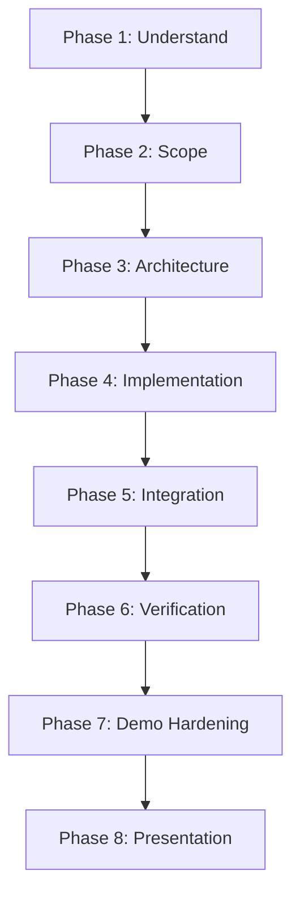

# Hackathon Builder — Fast-Track Engineering Workflow

This skill guides the end-to-end execution of our 24-hour hackathon project for HackNEX 2026. It enforces disciplined scoping, rapid prototyping, continuous verification, and demo-first hardening.

---

## Workflow Phases

---

### PHASE 1 — Understand
Before writing any code or selecting dependencies, dissect the challenge:
1. **Problem Statement:** What is the core, unvarnished problem we are solving?
2. **Target User Persona:** Who is directly affected, and what is their daily workflow?
3. **Pain Point:** What is currently broken, slow, expensive, or missing?
4. **Constraints:** Time (24h offline), hardware, API quotas, network limits, offline feasibility.
5. **Desired Outcome:** What does the ideal resolved state look like for the user?
6. **Judging Opportunity:** How does this solution align with the HackNEX criteria (AI & Emerging Tech, technical depth, real-world usefulness, working quality)?

---

### PHASE 2 — Scope
Categorize every planned feature into a strict MoSCoW matrix:
- **Must Have (P0):** The minimal, unbroken critical path that demonstrates the core innovation. If this fails, the demo fails.
- **Should Have (P1):** High-value supporting features (e.g., export, history, visual feedback) implemented *only* after P0 is verified.
- **Nice to Have (P2):** Delight features, dark/light toggle, extra analytics. **Never start on P2 functionality until P0 and P1 are locked and tested.**
- **Out of Scope:** Features explicitly deprioritized for this 24-hour sprint.

---

### PHASE 3 — Architecture
Design for speed, clarity, and zero-headache deployment:
- **Keep It Simple:** Monolithic or single-folder fullstack apps are almost always faster to develop and debug than multi-service setups.
- **Data Flow Contracts:** Define TypeScript interfaces or JSON schemas for data exchange between layers before implementation.
- **Deterministic vs. Generative:**
  - Use regex, SQL, or deterministic business logic for predictable operations.
  - Use LLMs/AI models exclusively where reasoning, unstructured comprehension, or generative synthesis is required.
- **Tooling Selection:** Choose mature, battle-tested libraries over bleeding-edge experimental tools.

---

### PHASE 4 — Implementation
Build the core engine first:
1. Implement the critical path end-to-end (the "golden path").
2. Stub secondary screens and auxiliary flows.
3. Write clean, self-documenting code with inline comments on critical logic.
4. Keep Git commits small and atomic after every working subsystem.

---

### PHASE 5 — Integration
Wire the components together:
1. Connect backend endpoints to frontend services.
2. Wire up AI/LLM SDKs and validate responses with strict schema parsers (e.g., Zod / Pydantic).
3. Populate the app with realistic, high-fidelity demo data (not generic "lorem ipsum").
4. Internally flag mock/demo datasets so development remains grounded in reality.

---

### PHASE 6 — Verification
Validate thoroughly before moving forward:
1. Execute build commands (`npm run build`, `python -m py_compile`, etc.).
2. Run test suites and linters.
3. Verify the live application behavior in the browser or terminal.
4. **Rule:** Never declare a feature or milestone complete without explicit, executed verification.

---

### PHASE 7 — Demo Hardening
Shield the demo from the "live demo curse":
1. **Identify Failure Modes:** API downtime, rate limits, slow Wi-Fi, malformed LLM responses, edge-case inputs.
2. **Implement Fallbacks:**
   - Graceful offline fallback cache or pre-computed responses for judges if the internet drops.
   - User-friendly error banners instead of uncaught promise rejections or white screens of death.
3. **Deterministic Seed State:** Provide a 1-click "Reset / Load Sample Scenario" button to ensure reproducible presentations.

---

### PHASE 8 — Presentation
Structure the product walkthrough around the 5-part demo formula:
1. **Problem:** Show the specific friction point in 30 seconds.
2. **Solution:** Reveal our system's novel approach.
3. **Technology:** Highlight the technical depth, architecture, and AI components.
4. **Live Result:** Run the live critical path workflow without hand-waving or slides.
5. **Impact:** Conclude with measurable real-world outcomes and commercial/practical viability.
