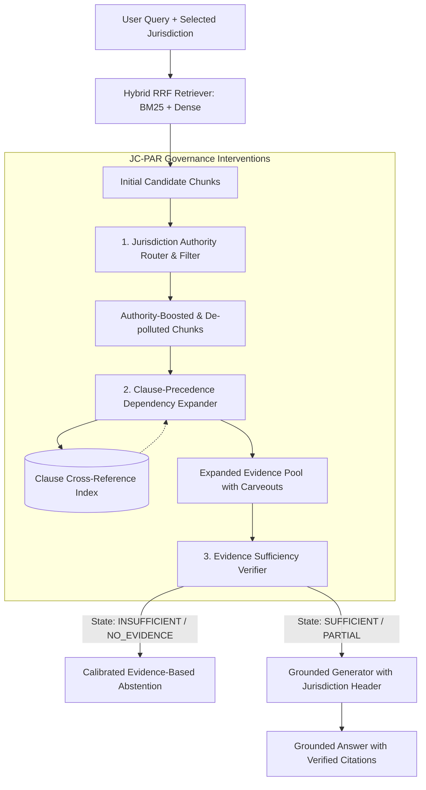

# JC-PAR: Jurisdiction-Conditioned Precedence-Aware RAG Architecture

**Classification:** Systems-Level Synthesis & Empirically Evaluated Intervention  
**Target Domain:** High-Assurance Legal & Regulatory Intelligence (HNX26EPS01)  
**Implementation Location:** [`src/interventions/`](file:///c:/Prabhav/Hacknex26/src/interventions/)  

---

## 1. System Architecture Overview

Standard RAG architectures fail on legal documents because they treat chunked text as flat, isolated bags of tokens and treat jurisdiction as ordinary query keywords. **JC-PAR** augments hybrid retrieval with structured legal governance layers:

---

## 2. Component Specifications

### 2.1 Jurisdiction Authority Router & Filter (JARF)
- **Module:** [`src/interventions/jarf.py`](file:///c:/Prabhav/Hacknex26/src/interventions/jarf.py)
- **Problem Solved:** Prevents general contract boilerplate (e.g., default Delaware freedom of contract) from overriding mandatory local statutes (e.g., California Business and Professions Code § 16600).
- **Algorithm:**
  1. Normalizes user-selected jurisdiction to canonical authority keys (`US-CAL`, `US-DEL`, `UK-ENG`, `EU-GDPR`, `SG`).
  2. Applies an additive authority boost (+2.5) to matching statutory schedule chunks in `DOC-009`.
  3. Suppresses conflicting out-of-jurisdiction schedules (-2.0 penalty).
  4. Formats an explicit `GOVERNING JURISDICTION` directive for downstream synthesis.

### 2.2 Clause-Precedence Dependency Expander (CPDE)
- **Module:** [`src/interventions/cpde.py`](file:///c:/Prabhav/Hacknex26/src/interventions/cpde.py)
- **Problem Solved:** Resolves carveout inversion where general rules (e.g., Section 8.1 consequential damages waiver) outrank narrow exceptions (Section 8.3 carveouts) due to surface lexical density.
- **Algorithm:**
  1. Inverted clause locator index maps `(doc_id, section_number)` -> `Chunk` across the corpus.
  2. Scans retrieved chunks for explicit precedence markers:
     - `"Subject to Section X"`
     - `"Notwithstanding Section Y"`
     - `"Except as provided in Section Z"`
     - `"Defined in Section 1"`
  3. Traverses detected reference edges and appends dependent carveout chunks directly into the candidate set with preserved provenance.
  4. Enforces a maximum expansion budget (default: 2 chunks) to prevent context dilution.

### 2.3 Evidence Sufficiency Verifier (ESV)
- **Module:** [`src/interventions/esv.py`](file:///c:/Prabhav/Hacknex26/src/interventions/esv.py)
- **Problem Solved:** Completely eliminates overconfident hallucinated answers on unanswerable legal queries.
- **Algorithm:**
  1. Deconstructs user query into core substantive subject phrases (e.g., "software escrow", "cyber insurance limits") and strips generic legal contract stopwords.
  2. Evaluates set-level factual coverage across the entire retrieved evidence pool.
  3. Classifies evidence sufficiency into five distinct states:
     - `SUFFICIENT`: Full factual grounding present.
     - `PARTIAL`: General rule present but specific qualifiers missing.
     - `CONFLICTING`: Unresolved contradictory provisions detected.
     - `INSUFFICIENT`: Core subject entity completely absent from documents.
     - `NO_RELEVANT_EVIDENCE`: Retrieval returned no relevant text.
  4. If state is `INSUFFICIENT` or `NO_RELEVANT_EVIDENCE`, ESV intercepts generation and returns an explicit, calibrated evidence-based refusal citing the specific missing facet.

---

## 3. Recommended Production Architecture

Based on Phase 3 empirical ablation findings, the recommended architecture for Phase 4 consists of:
1. **Dynamic Expansion Window:** Rather than forcing expanded chunks into a fixed `top_k=4` window (which incurs the Fixed-Window Eviction Penalty on multi-hop chunks), the context window should dynamically expand:
   $$K_{\text{context}} = K_{\text{base}} + N_{\text{expanded}}$$
2. **Relevance-Gated Authority Boosting:** Ensure that JARF only promotes statutory schedules when query terms share semantic domain with the schedule topic.
3. **Calibrated Sufficiency Gate:** Retain ESV as the primary defense against hallucination and overconfidence.
